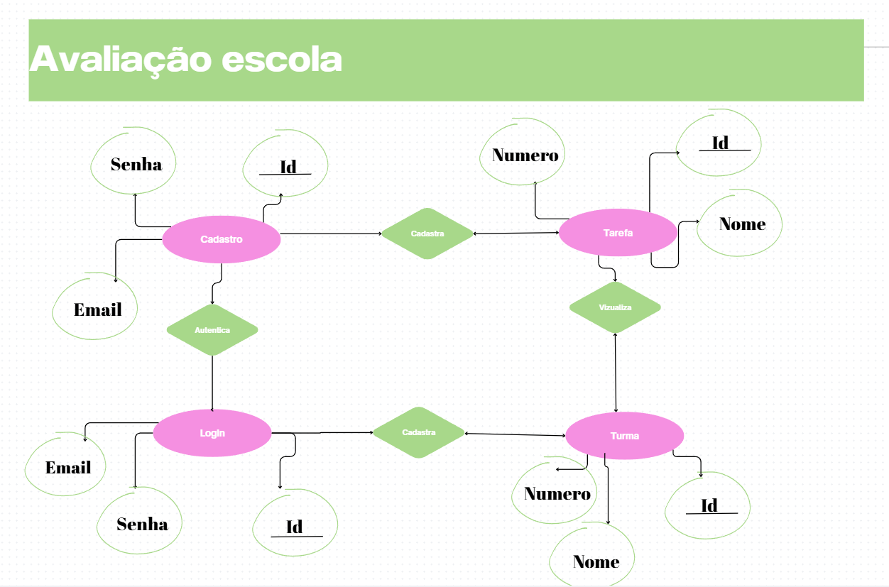
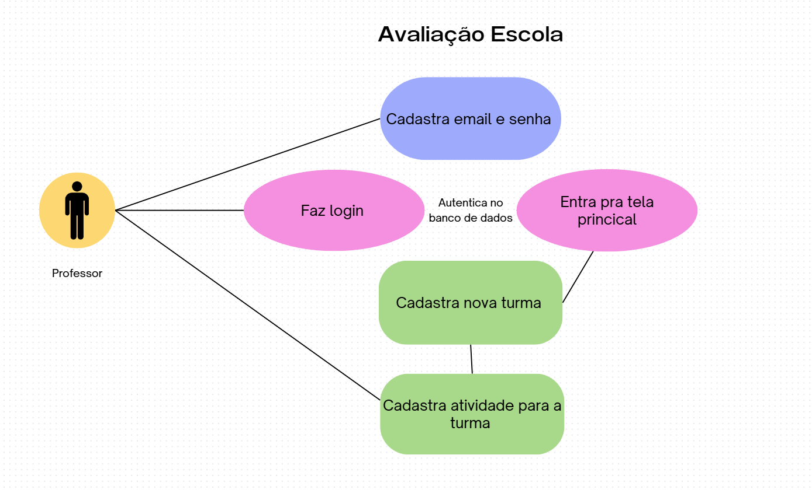
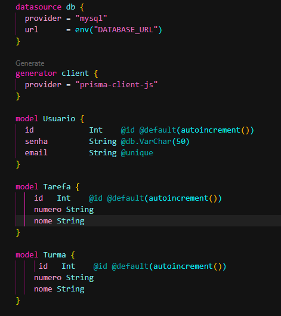

# Escola avaliação prática

## Ambiente de desenvolvimento
- Node.js
- MySQL (XAMPP)
- Prisma ORM
- React.js
- Vite

## Passo a passo para executar o projeto localmente

- Clone o repositório
- Configure o banco de dados MySQL
- Acesse a pasta web e instale as dependências
```bash
cd web
npm install
```
- Adicione o arquivo `.env` na raiz do projeto com a seguinte configuração:
- Certifique-se de que o MySQL está em execução (usando XAMPP)

```bash
DATABASE_URL="mysql://root@localhost:3306/escola"
```
- Execute as migrações do Prisma para configurar o banco de dados
```bash
npx prisma migrate dev --name init
```
- Inicie o servidor de desenvolvimento
```bash
npm run dev
```
- acesse a pasta do front end `./web` instale as dependências e inicie o servidor de desenvolvimento
```bash
cd web
npm install
npm run dev
```
Clicar no link localhost para executar, semelhante a este http://localhost:5173/

- Agora na area de trabalho quando abrir a pasta escolaavaliacao no explorer entre na api e abra com git bash e execute
```bash
npx nodemon
```

## Der

## Uml

## Banco de dados

